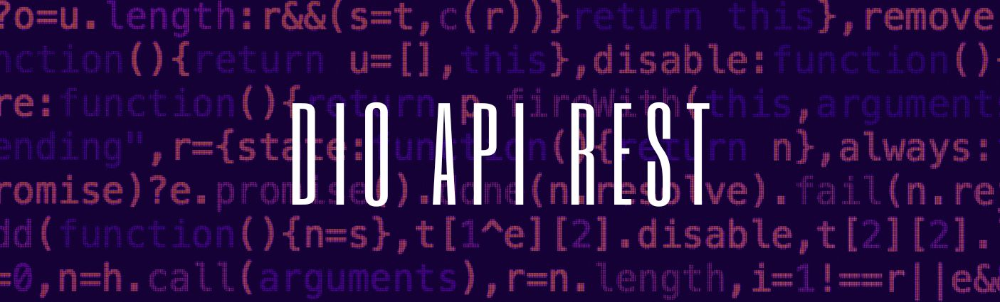

<!-- Inserir titulo do projeto aqui -->
# DIO API REST

<!-- Inserir foto de capa do projeto aqui -->

<!-- Inserir tags relevantes aqui -->

## Sumário
- [DIO API REST](#dio-api-rest)
  - [Sumário](#sumário)
  - [Introdução](#introdução)
    - [Observações:](#observações)
  - [Tecnologias Usadas](#tecnologias-usadas)
  - [Licença](#licença)

## Introdução
O projeto em questão demonstra a construção parcial de uma API em PHP puro, utilizando uma arquitetura MVC (parcialmente implementada). A ferramenta Postman foi utilizada para realizar testes e garantir o funcionamento da API.

### Observações:

**Ausência de banco de dados:** O projeto não utiliza um banco de dados tradicional, pois o foco principal reside no aprendizado da construção de APIs sem frameworks ou bibliotecas.

**Armazenamento de dados:** Um arquivo JSON é utilizado para armazenar e manipular dados, suprindo a necessidade de um sistema de persistência de dados.

## Tecnologias Usadas
&nbsp;
&nbsp;
&nbsp;
&nbsp;
&nbsp;

<!-- ## Estrutura do Projeto
Para entender a estrutura do projeto, consulte [Estrutura do Projeto](link_para_o_documentacao_estrutura.md). -->

<!-- ## Como Executar o Projeto
Para obter instruções sobre como executar o projeto, consulte [Como Executar o Projeto](link_para_o_documentacao_execucao.md). -->

## Licença
Este projeto está sob a [MIT](./LICENSE). Consulte o arquivo [LICENSE.md](LICENSE.md) para obter mais detalhes.